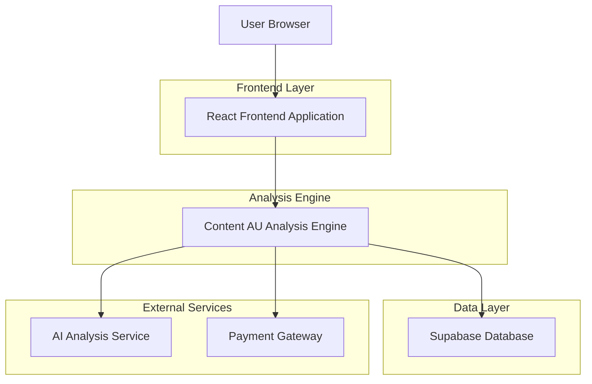
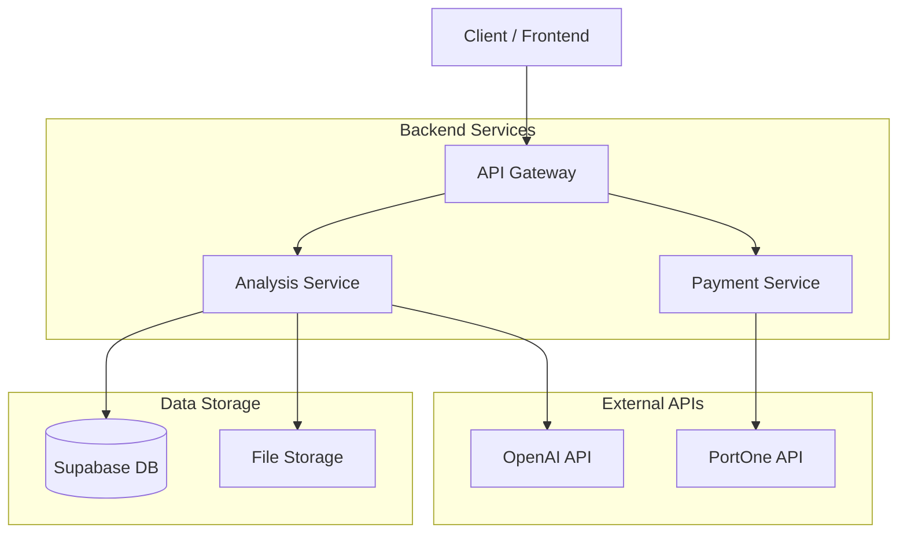
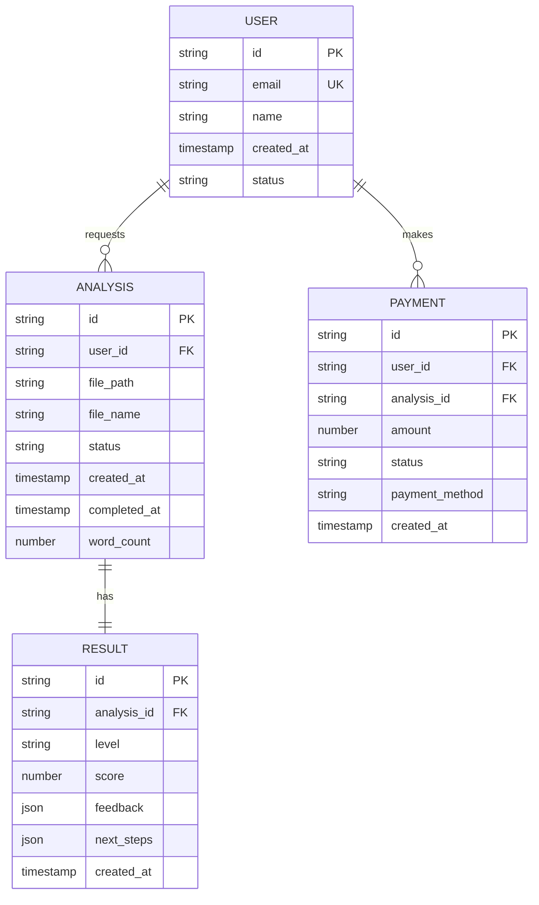

## 1. Architecture design



## 2. Technology Description
- Frontend: React@18 + tailwindcss@3 + vite
- Initialization Tool: vite-init
- Backend: Supabase (PostgreSQL)
- Payment: PortOne (토스페이먼츠)
- File Storage: Supabase Storage
- AI Analysis: OpenAI GPT-4 API

## 3. Route definitions
| Route | Purpose |
|-------|---------|
| / | 메인 랜딩 페이지, 서비스 소개 및 CTA |
| /upload | 원고 업로드 및 결제 페이지 |
| /analysis/:id | 분석 진행 상태 표시 페이지 |
| /result/:id | 분석 결과 확인 페이지 |
| /hanajeon | 한나전 프로그램 소개 및 신청 페이지 |
| /blamit | 블라밋 프로그램 안내 페이지 |

## 4. API definitions
### 4.1 Core API

원고 분석 요청
```
POST /api/analyze
```

Request:
| Param Name| Param Type  | isRequired  | Description |
|-----------|-------------|-------------|-------------|
| manuscript  | file      | true        | 업로드할 원고 파일 (PDF, DOC, TXT) |
| email  | string      | true        | 사용자 이메일 주소 |
| title  | string      | false       | 원고 제목 |

Response:
| Param Name| Param Type  | Description |
|-----------|-------------|-------------|
| analysisId    | string     | 분석 ID |
| status    | string     | 분석 상태 (pending, processing, completed) |
| estimatedTime    | number     | 예상 분석 시간 (분) |

Example
```json
{
  "analysisId": "550e8400-e29b-41d4-a716-446655440000",
  "status": "processing",
  "estimatedTime": 15
}
```

### 4.2 분석 결과 조회
```
GET /api/analyze/:id
```

Response:
| Param Name| Param Type  | Description |
|-----------|-------------|-------------|
| result    | string     | 분석 결과 (author_level, draft_level) |
| score    | number     | 저자 레벨 점수 (0-100) |
| feedback    | object     | 상세 피드백 정보 |
| nextStep    | string     | 다음 단계 안내 |

Example
```json
{
  "result": "author_level",
  "score": 85,
  "feedback": {
    "structure": "우수",
    "content_depth": "충분",
    "marketability": "높음"
  },
  "nextStep": "hanajeon"
}
```

### 4.3 결제 처리
```
POST /api/payment
```

Request:
| Param Name| Param Type  | isRequired  | Description |
|-----------|-------------|-------------|-------------|
| analysisId  | string      | true        | 분석 ID |
| amount  | number      | true        | 결제 금액 |
| paymentMethod  | string      | true        | 결제 방법 |

Response:
| Param Name| Param Type  | Description |
|-----------|-------------|-------------|
| paymentId    | string     | 결제 ID |
| status    | string     | 결제 상태 |

## 5. Server architecture diagram


## 6. Data model

### 6.1 Data model definition


### 6.2 Data Definition Language

사용자 테이블 (users)
```sql
-- create table
CREATE TABLE users (
    id UUID PRIMARY KEY DEFAULT gen_random_uuid(),
    email VARCHAR(255) UNIQUE NOT NULL,
    name VARCHAR(100),
    status VARCHAR(20) DEFAULT 'active' CHECK (status IN ('active', 'inactive')),
    created_at TIMESTAMP WITH TIME ZONE DEFAULT NOW()
);

-- create index
CREATE INDEX idx_users_email ON users(email);
CREATE INDEX idx_users_created_at ON users(created_at DESC);
```

분석 테이블 (analyses)
```sql
-- create table
CREATE TABLE analyses (
    id UUID PRIMARY KEY DEFAULT gen_random_uuid(),
    user_id UUID NOT NULL REFERENCES users(id),
    file_path TEXT NOT NULL,
    file_name VARCHAR(255) NOT NULL,
    status VARCHAR(20) DEFAULT 'pending' CHECK (status IN ('pending', 'processing', 'completed', 'failed')),
    word_count INTEGER,
    created_at TIMESTAMP WITH TIME ZONE DEFAULT NOW(),
    completed_at TIMESTAMP WITH TIME ZONE
);

-- create index
CREATE INDEX idx_analyses_user_id ON analyses(user_id);
CREATE INDEX idx_analyses_status ON analyses(status);
CREATE INDEX idx_analyses_created_at ON analyses(created_at DESC);
```

결과 테이블 (results)
```sql
-- create table
CREATE TABLE results (
    id UUID PRIMARY KEY DEFAULT gen_random_uuid(),
    analysis_id UUID UNIQUE NOT NULL REFERENCES analyses(id),
    level VARCHAR(20) NOT NULL CHECK (level IN ('author_level', 'draft_level')),
    score INTEGER CHECK (score >= 0 AND score <= 100),
    feedback JSONB,
    next_steps JSONB,
    created_at TIMESTAMP WITH TIME ZONE DEFAULT NOW()
);

-- create index
CREATE INDEX idx_results_analysis_id ON results(analysis_id);
CREATE INDEX idx_results_level ON results(level);
```

결제 테이블 (payments)
```sql
-- create table
CREATE TABLE payments (
    id UUID PRIMARY KEY DEFAULT gen_random_uuid(),
    user_id UUID NOT NULL REFERENCES users(id),
    analysis_id UUID NOT NULL REFERENCES analyses(id),
    amount INTEGER NOT NULL,
    status VARCHAR(20) DEFAULT 'pending' CHECK (status IN ('pending', 'completed', 'failed', 'refunded')),
    payment_method VARCHAR(50),
    created_at TIMESTAMP WITH TIME ZONE DEFAULT NOW()
);

-- create index
CREATE INDEX idx_payments_user_id ON payments(user_id);
CREATE INDEX idx_payments_analysis_id ON payments(analysis_id);
CREATE INDEX idx_payments_status ON payments(status);
```

## 7. Information Architecture

### 7.1 메인 콘텐츠 구조
```
홈페이지
├── 히어로 섹션
│   ├── 헤더 로고
│   ├── 주요 헤드라인
│   ├── 서브 헤드라인
│   └── CTA 버튼
├── 문제 인식 섹션
│   ├── 원고는 있지만 확신이 없다
│   ├── AI로 쓰면 색깔이 사라진다
│   └── 경험은 많지만 구조가 안 보인다
├── 핵심 기능 섹션
│   ├── 원고 재구성 기능
│   ├── 출판 판단 가능 상태
│   └── 저자 레벨 판별
├── 저자 레벨 정의 섹션
│   ├── 저자 레벨이란?
│   ├── 도달 시 얻게 되는 것들
│   └── 시스템 기준 설명
├── 입력 기준 섹션
│   ├── 최소 분량 요구사항
│   ├── 허용 원고 유형
│   └── 기준 미달 시 안내
├── 결과 유형 섹션
│   ├── Author Level (통과)
│   └── Draft Level (준비 단계)
├── 프로그램 설명 섹션
│   ├── 블라밋 (준비단계)
│   ├── 한나전 (데뷔과정)
│   └── 포메리 (확장단계)
├── 가격 흐름 섹션
│   ├── 단계별 가격표
│   └── 결제 프로세스
└── 최종 CTA 섹션
    └── 저자 레벨 확인하기 버튼
```

### 7.2 네비게이션 구조
```
글로벌 네비게이션
├── 로고 (홈 링크)
├── 서비스 소개
├── 가격 안내
├── 문의하기
└── 시작하기 버튼

푸터 네비게이션
├── 서비스
│   ├── Content AU
│   ├── 블라밋
│   ├── 한나전
│   └── 포메리
├── 지원
│   ├── 자주 묻는 질문
│   ├── 문의하기
│   └── 이용약관
└── 회사 정보
    ├── 회사 소개
    ├── 개인정보처리방침
    └── 채용 정보
```

### 7.3 사용자 흐름 설계
```
방문자 플로우
├── 진입 (검색, SNS, 추천)
├── 문제 인식 (랜딩 페이지)
├── 관심 유발 (기능 소개)
├── 욕구 형성 (결과 예시)
├── 행동 유도 (CTA 클릭)
└── 전환 (결제 완료)

사용자 여정
├── 1단계: 문제 인식
│   └── "원고는 있는데 이게 책이 될지 모르겠다"
├── 2단계: 해결책 탐색
│   └── "Content AU가 도움을 줄 수 있을까?"
├── 3단계: 신뢰 형성
│   └── "시스템 기준이라는게 믿을만한가?"
├── 4단계: 행동 결정
│   └── "한번 시도해볼까?"
└── 5단계: 결과 확인
    └── "내가 저자 레벨인지 아닌지"
```

### 7.4 콘텐츠 전략
```
설득의 논리적 흐름
1. 문제 제기: 원고는 있지만 확신이 없는 상태
2. 해결책 제시: Content AU의 저자 레벨 판별
3. 신뢰 구축: 시스템 기준과 명확한 결과
4. 행동 유도: 구체적인 다음 단계 안내
5. 위험 제거: 명확한 기준과 프로세스 설명

키 메시지 전개
├── "글을 대신 써주지 않습니다"
├── "원고를 출판 가능한 상태로 재구성합니다"
├── "저자 레벨은 감각이 아니라 시스템 기준입니다"
└── "모든 글이 책이 될 필요는 없습니다"
```