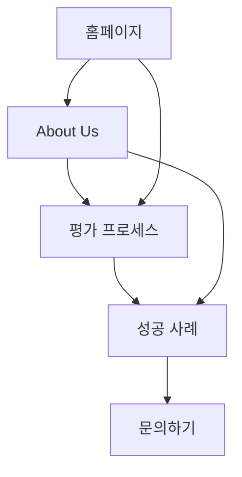

## 1. Product Overview
Content AU는 AI 기반 콘텐츠 최적화 플랫폼으로, 출판사와 전문 편집자의 전문성을 바탕으로 저자들의 원고를 분석하고 개선 가능성을 객관적으로 평가합니다. 

문학 출판 전문성과 AI 기술을 결합하여 저자들의 창작 가능성을 현실적으로 평가하고, 출판 성공률을 높이는 데 도움을 줍니다.

## 2. Core Features

### 2.1 User Roles
| Role | Registration Method | Core Permissions |
|------|---------------------|------------------|
| 일반 저자 | 이메일 가입 | 원고 분석 요청, 피드백 확인, 기본 통계 조회 |
| 프리미엄 저자 | 유료 구독 | 심층 분석, 전문가 피드백, 우선 지원 |
| 출판 전문가 | 승인된 전문가 계정 | 원고 평가, 피드백 제공, 평가 기준 설정 |

### 2.2 Feature Module
Content AU 소개 및 신뢰성 구축을 위한 핵심 페이지:
1. **홈페이지**: 서비스 소개, 핵심 가치, 신뢰 신호
2. **About Us**: 회사 정체성, 전문성, 방법론 소개
3. **평가 프로세스**: AI 분석 방식, 출판 전문성 근거
4. **성공 사례**: 실제 개선 사례, 출판 성공 스토리
5. **문의하기**: 전문가 상담, 파트너십 문의

### 2.3 Page Details
| Page Name | Module Name | Feature description |
|-----------|-------------|---------------------|
| 홈페이지 | 히어로 섹션 | Content AU의 전문성과 AI 기술 결합 소개. "출판사가 만든 AI 콘텐츠 분석"이라는 신뢰성 강조 |
| 홈페이지 | 신뢰 신호 | 출판 경력, 전문가 네트워크, AI 기술 파트너십 시각화 |
| About Us | 회사 정체성 | 창립자의 출판업계 경력, 핵심 팀원의 전문성, 문학 출판 전문성 강조 |
| About Us | 평가 방법론 | AI 알고리즘과 출판 전문가의 이중 검증 시스템 설명 |
| 평가 프로세스 | 분석 기준 | 문학성, 시장성, 독자 반응 예측 등 구체적인 평가 지표 제시 |
| 평가 프로세스 | 기술 근거 | AI 모델 학습 데이터, 출판 전문가 참여 방식, 정확도 데이터 |
| 성공 사례 | 사례 studies | 실제 저자의 개선 전후 비교, 출판 성공률 향상 통계 |
| 문의하기 | 전문가 매칭 | 출판 전문가와의 1:1 상담 예약 시스템 |

## 3. Core Process
**저자 플로우:**
홈페이지 방문 → About Us에서 Content AU의 전문성 확인 → 평가 프로세스 이해 → 원고 분석 요청 → 결과 확인 및 개선 방향 수립

**신뢰 구축 플로우:**
전문성 소개 → 방법론 공개 → 실적 증명 → 직접 경험 → 전문가 상담

## 4. User Interface Design

### 4.1 Design Style
- **Primary Color**: 딥 블루 (#1a365d) - 전문성과 신뢰감
- **Secondary Color**: 웜 그레이 (#718096) - 중립성과 객관성
- **Accent Color**: 골드 (#d69e2e) - 프리미엄感和 성공
- **Button Style**: 플랫 디자인에 미세한 그림자, 둥근 모서리 8px
- **Font**: Noto Sans KR, 제목 24-32px, 본문 16px, 캡션 14px
- **Layout**: 카드 기반 그리드, 충분한 여백으로 전문성 표현
- **Icon Style**: 라인 아이콘, 두께 2px, 간결하고 현대적

### 4.2 Page Design Overview
| Page Name | Module Name | UI Elements |
|-----------|-------------|-------------|
| 홈페이지 | 히어로 섹션 | 전문가 팀 사진 배경, "출판사가 만든 AI" 헤드라인, 신뢰 지표 3개 카드 |
| About Us | 전문성 소개 | 타임라인 형식의 경력, 팀원 프로필 사진, 출판사 로고 콜라주 |
| 평가 프로세스 | 방법론 다이어그램 | 3단계 프로세스 시각화, 각 단계별 상세 설명 카드 |
| 성공 사례 | 사례 카드 | 전후 비교 이미지, 출판 성공률 그래프, 저자 추천글 |

### 4.3 Responsiveness
데스크톱 퍼스트 접근법, 태블릿과 모바일에서 반응형으로 최적화. 터치 인터랙션을 고려한 버튼 크기와 간격 설계.

### 4.4 3D Scene Guidance
해당 없음