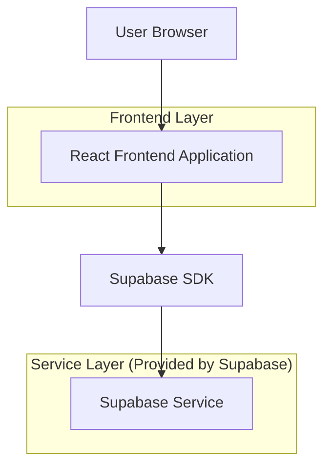

## 1. Architecture design

## 2. Technology Description
- Frontend: React@18 + tailwindcss@3 + vite
- Initialization Tool: vite-init
- Backend: Supabase (Authentication, Database, Storage)
- Additional Libraries: 
  - @supabase/supabase-js (Supabase 클라이언트)
  - react-router-dom@6 (라우팅)
  - lucide-react (아이콘)
  - framer-motion (애니메이션)

## 3. Route definitions
| Route | Purpose |
|-------|---------|
| / | 홈페이지, Content AU 소개 및 신뢰 신호 |
| /about | About Us 페이지, 회사 정체성과 전문성 소개 |
| /process | 평가 프로세스 페이지, AI 분석 방법론 설명 |
| /cases | 성공 사례 페이지, 실적 증명과 추천글 |
| /contact | 문의하기 페이지, 전문가 상담 예약 |

## 4. API definitions
해당 없음 - 정적 콘텐츠 기반 소개 페이지로 API 없이 Supabase 정적 콘텐츠 관리만 사용

## 5. Server architecture diagram
해당 없음 - Supabase BaaS 활용으로 별도 서버 아키텍처 불필요

## 6. Data model
해당 없음 - 정적 콘텐츠 기반으로 데이터베이스 모델 불필요