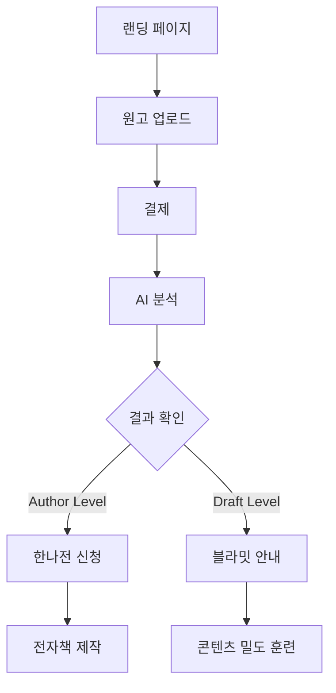

## 1. Product Overview
Content AU는 원고를 가진 사람들이 자신의 글이 책이 될 수 있는지를 객관적으로 판단할 수 있게 도와주는 저자 레벨 판별 엔진입니다. 
AI가 대신 써주는 것이 아니라, 사용자의 원고를 출판 가능한 구조로 재구성하여 "저자"로서의 자격을 명확히 보여줍니다.

## 2. Core Features

### 2.1 User Roles
| Role | Registration Method | Core Permissions |
|------|---------------------|------------------|
| 일반 사용자 | 이메일 회원가입 | 원고 분석 요청, 결과 확인 |
| 한나전 참가자 | Author Level 통과 후 승인 | 전자책 제작 프로그램 접근 |
| 블라밋 참가자 | Draft Level 결과 후 안내 | 콘텐츠 밀도 훈련 프로그램 접근 |

### 2.2 Feature Module
Content AU 랜딩 페이지는 다음 주요 페이지로 구성됩니다:
1. **메인 랜딩**: 히어로 섹션, 서비스 소개, 저자 레벨 확인 CTA
2. **결제/분석**: 원고 업로드, 결제, 분석 진행 상태
3. **결과 확인**: 분석 결과 표시, 다음 단계 안내

### 2.3 Page Details
| Page Name | Module Name | Feature description |
|-----------|-------------|---------------------|
| 메인 랜딩 | 히어로 섹션 | 저자 레벨 판별 엔진이라는 핵심 메시지와 함께 주요 가치 제안 표시 |
| 메인 랜딩 | 문제 인식 | 원고는 있지만 책이 될지 확신이 없는 사용자의 불확실성 강조 |
| 메인 랜딩 | 핵심 기능 | 원고를 출판 판단 가능한 상태로 재구성한다는 핵심 기능 설명 |
| 메인 랜딩 | 저자 레벨 정의 | "이 사람은 이 주제의 저자다"라고 설명 가능한 상태의 구체적 기준 제시 |
| 메인 랜딩 | 입력 기준 | 최소 A4 20페이지(8,000자), 최적 30-60페이지 분량 요구사항 명시 |
| 메인 랜딩 | 결과 유형 | Author Level 통과와 Draft Level 미달의 두 가지 결과 설명 |
| 메인 랜딩 | 프로그램 설명 | 블라밋(준비단계), 한나전(데뷔과정), 포메리(확장단계)의 차이점 설명 |
| 메인 랜딩 | 가격 흐름 | Content AU → 한나전/블라밋 → 포메리로 이어지는 단계별 가격 구조 |
| 메인 랜딩 | 최종 CTA | "내 원고로 저자 레벨 확인하기" 버튼으로 변환 유도 |
| 결제/분석 | 원고 업로드 | PDF, Word, 텍스트 파일 업로드 기능 |
| 결제/분석 | 결제 처리 | Content AU 분석 비용 결제 |
| 결제/분석 | 분석 진행 | AI 분석 진행 상태 표시바 |
| 결과 확인 | 결과 요약 | Author Level 또는 Draft Level 결과 표시 |
| 결과 확인 | 다음 단계 | 결과에 따른 한나전 신청 또는 블라밋 안내 |

## 3. Core Process
### 일반 사용자 플로우
1. 랜딩 페이지 접속 → 히어로 섹션의 핵심 메시지 확인
2. 서비스 이해 → 저자 레벨 판별의 필요성 인식
3. 원고 준비 확인 → 입력 기준 확인
4. [내 원고로 저자 레벨 확인하기] 클릭
5. 원고 업로드 및 결제
6. 분석 결과 확인
7. 결과에 따른 분기: Author Level → 한나전 신청, Draft Level → 블라밋 안내

## 4. User Interface Design
### 4.1 Design Style
- **Primary Color**: #1a1a1a (딥블랙) - 전문성과 신뢰감 표현
- **Secondary Color**: #f5f5f5 (라이트 그레이) - 깔끔한 배경
- **Accent Color**: #ff6b35 (오렌지) - CTA 버튼 강조
- **Button Style**: 둥근 모서리, 2px 테두리, 호버 시 색상 변화
- **Font**: Noto Sans KR, 제목 32-48px, 본문 16-18px
- **Layout**: 싱글 컬럼, 카드 기반 섹션 구분
- **Icon Style**: 라인 아이콘, 최소한의 사용

### 4.2 Page Design Overview
| Page Name | Module Name | UI Elements |
|-----------|-------------|-------------|
| 메인 랜딩 | 히어로 섹션 | 중앙 정렬 텍스트, 큰 폰트 크기, 강렬한 대비, 단일 CTA 버튼 |
| 메인 랜딩 | 문제 인식 | 아이콘과 함께 3단계 문제 제시, 카드 형태 레이아웃 |
| 메인 랜딩 | 핵심 기능 | 왼쪽 텍스트, 오른쪽 이미지의 지그재그 레이아웃 |
| 메인 랜딩 | 저자 레벨 | 번호가 있는 리스트, 체크 아이콘으로 명확성 강조 |
| 메인 랜딩 | 입력 기준 | 경고색 박스로 최소 요구사항 강조 |
| 메인 랜딩 | 결과 유형 | 두 가지 결과를 색상으로 구분된 카드로 표시 |
| 메인 랜딩 | 프로그램 설명 | 타임라인 형태로 3단계 프로그램 진행 과정 표시 |
| 메인 랜딩 | 가격 흐름 | 단계별 가격과 포함 내용을 테이블로 명확히 표시 |
| 메인 랜딩 | 최종 CTA | 페이지 하단에 고정된 형태의 큰 CTA 버튼 |

### 4.3 Responsiveness
- 데스크톱 우선 설계 (Desktop-first)
- 태블릿: 768px 이하에서 2단계 레이아웃으로 조정
- 모바일: 480px 이하에서 싱글 컬럼, 큰 터치 타겟
- 반응형 타이포그래피: 뷰포트 크기에 따른 폰트 크기 조정

### 4.4 Conversion Optimization
- 히어로 섹션에 단일 CTA로 집중도 높임
- 스크롤 시 섹션별로 점진적 정보 제공
- 각 섹션 끝마다 미니 CTA로 변환 기회 제공
- 결과 페이지에서 즉시 다음 단계로 이동 가능하도록 설계