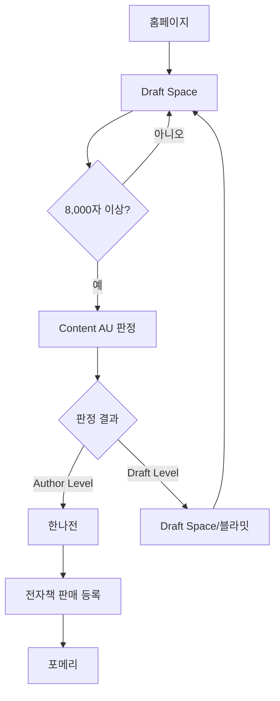

## 1. 제품 개요

Content AU는 AI 글쓰기 도구가 아닌, 사용자의 원고를 기반으로 저자 가능성을 판단하고 다음 단계 경로를 제시하는 Stage 기반 저자 파이프라인 엔진입니다. Draft Space부터 포메리까지 이어지는 저자 생애주기의 핵심(Core) 역할을 수행합니다.

* 문제 해결: 원고가 없거나 출판 가능성을 판단할 기준이 없는 사용자들에게 명확한 판단 기준 제공

* 대상 사용자: 전자책 출판을 고려하지만 원서나 판단 기준이 부족한 예비 저자들

* 시장 가치: AI 글쓰기 도구 시장의 구조적 공백(출판 판단 기능)을填补하는 차별화된 서비스

## 2. 핵심 기능

### 2.1 사용자 역할

| 역할     | 가입 방식          | 핵심 권한                            |
| ------ | -------------- | -------------------------------- |
| 예비 저자  | 이메일 가입         | Draft Space 이용, Content AU 판정 신청 |
| 판정 완료자 | Content AU 통과자 | 한나전 진입, 포메리 확장                   |

### 2.2 기능 모듈

Content AU는 다음 주요 페이지로 구성됩니다:

1. **홈페이지**: 서비스 소개, Stage 구조 설명, 시작하기 버튼
2. **Draft Space**: 자유 글쓰기 공간, 실시간 분량 표시, Content AU 전환 트리거
3. **Content AU 판정**: 원고 업로드, 저자 레벨 판정, 상세 리포트 제공
4. **판정 결과**: Author Level/Draft Level 결과, 다음 단계 안내
5. **한나전**: 전자책 판매 채널 등록 가이드, 데뷔 완료
6. **포메리**: 저자 확장 경로 설계, 비즈니스 구조 구축

### 2.3 페이지 상세

| 페이지명        | 모듈명     | 기능 설명                                                   |
| ----------- | ------- | ------------------------------------------------------- |
| 홈페이지        | 서비스 소개  | Stage 기반 저자 파이프라인 구조를 시각적으로 설명하고 각 Stage의 역할 명시         |
| 홈페이지        | 시작하기    | Draft Space 무료 이용 또는 로그인 안내로 연결                         |
| Draft Space | 글쓰기 에디터 | 자동 저장, 실시간 글자 수/분량 표시, A4 기준 페이지 수 환산 표시                |
| Draft Space | 진행 상태   | Content AU 최소 기준(8,000자)까지 남은 분량 시각적 표시                 |
| Draft Space | 전환 트리거  | 최소 분량 도달 시 Content AU 판정 신청 버튼 활성화                      |
| Content AU  | 원고 제출   | 파일 업로드 또는 Draft Space에서 바로 제출, 분량 자동 확인                 |
| Content AU  | 판정 처리   | 원고 분석, 저자 레벨 판정, 출판 가능성 평가                              |
| Content AU  | 리포트 생성  | 저자 레벨 판정 요약, 출판 기준 체크리스트, 구조·논지·독자 관점 분석                |
| 판정 결과       | 결과 표시   | Author Level/Draft Level 명확히 표시, 시각적 구분                 |
| 판정 결과       | 다음 단계   | Author Level → 한나전 진입, Draft Level → Draft Space/블라밋 안내 |
| 한나전         | 채널 선택   | 크몽, 유페이퍼, 덕앤클레오 중 1개 이상 판매 채널 선택                        |
| 한나전         | 등록 가이드  | 선택한 채널별 전자책 등록 절차 단계별 안내                                |
| 한나전         | 데뷔 완료   | 최소 1개 채널 등록 완료 시 공식 데뷔 인증                               |
| 포메리         | 확장 경로   | 강의, 브랜드, 커뮤니티 등 저자 비즈니스 확장 옵션 제시                        |

## 3. 핵심 프로세스

### 예비 저자 플로우

1. 홈페이지 접속 → Draft Space 시작
2. 원고 작성(8,000자 이상) → Content AU 판정 신청
3. 판정 결과 확인 → Author Level 시 한나전 진입
4. 전자책 제작 및 판매 채널 등록 → 데뷔 완료
5. 포메리에서 확장 경로 설계

## 4. 사용자 인터페이스 설계

### 4.1 디자인 스타일

* **주요 색상**: 진한 남색(#1a365d) - 전문성과 신뢰감, 보조색상 - 밝은 주황(#ff6b35) - 활력과 창의성

* **버튼 스타일**: 둥근 모서리(8px radius), 그림자 효과로 입체감 부여

* **폰트**: Noto Sans KR, 본문 16px, 제목 24-32px 계층적 구성

* **레이아웃**: 카드 기반 그리드 시스템, 위쪽 네비게이션 바

* **아이콘**: 라인 아이콘 스타일, Stage 진행을 표시하는 계단식 아이콘 사용

### 4.2 페이지 디자인 개요

| 페이지명        | 모듈명    | UI 요소                                              |
| ----------- | ------ | -------------------------------------------------- |
| 홈페이지        | 서비스 소개 | Stage 다이어그램 애니메이션, 각 Stage별 설명 카드 호버 효과            |
| Draft Space | 에디터    | 깔끔한 흰색 배경, 실시간 카운터가 우측 상단에 고정, 자동 저장 표시            |
| Content AU  | 판정 신청  | 드래그앤드롭 파일 업로드, 진행률 바, 예상 처리 시간 표시                  |
| 판정 결과       | 결과 표시  | Author Level은 초록색 배경, Draft Level은 주황색 배경으로 명확히 구분 |
| 한나전         | 채널 선택  | 채널 로고와 간단한 설명이 담긴 선택형 카드, 다중 선택 가능                 |

### 4.3 반응형 설계

* 데스크톱 우선 설계, 태블릿과 모바일에서 적응형 레이아웃

* 터치 최적화: 버튼 크기 44px 이상, 터치 대상 간격 충분히 확보

* 모바일에서는 Stage 다이어그램을 세로 스크롤 형태로 전환

## 5. 결제 구조

* **Draft Space**: 무료 (문서 수·총 글자 수 제한, 미사용 시 자동 삭제)

* **Content AU**: 유료 판정 서비스 (1회 판정 기준)

* **한나전**: 무료 진입 (전자책 제작 비용은 별도)

* **포메리**: 유료 확장 프로그램

## 6. 성공 지표

* Stage 0 → Stage 1 전환율 (Draft Space → Content AU)

* Author Level 판정 비율

* Content AU → 한나전 전환율

* 한나전 → 포메리 진입률

* 전체 파이프라인 완료

