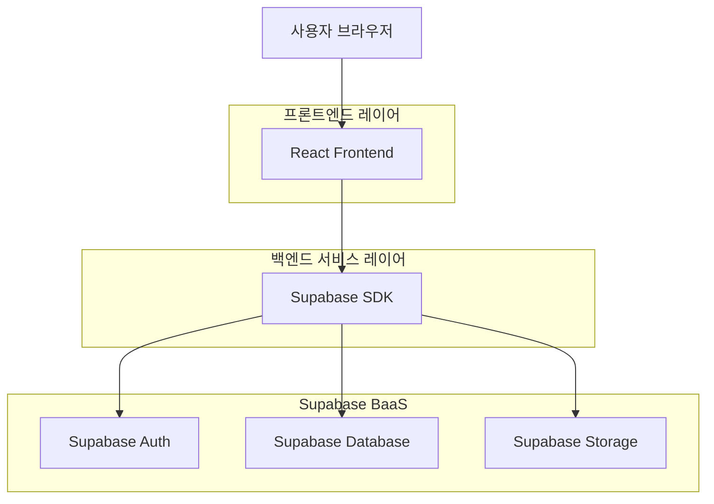
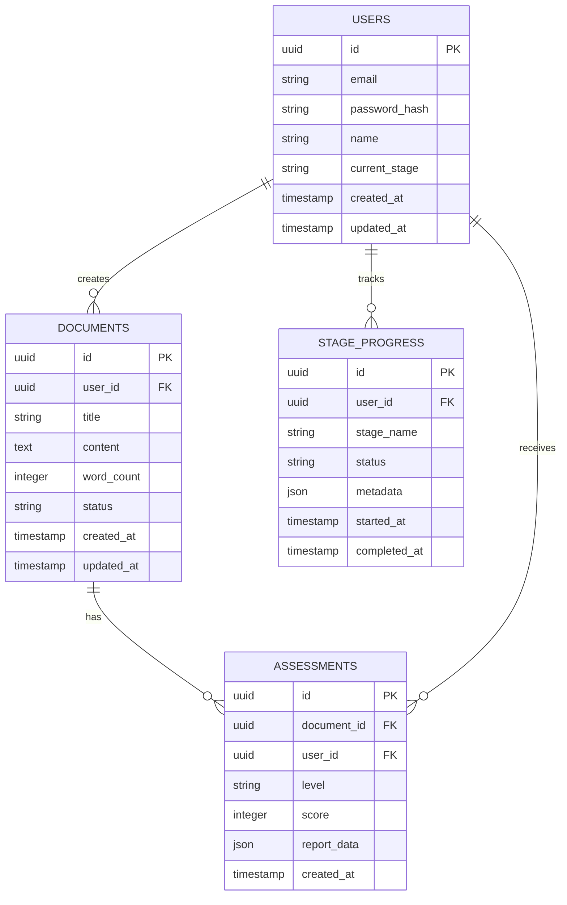

## 1. 아키텍처 설계



## 2. 기술 스택
- **프론트엔드**: React@18 + TypeScript + Tailwind CSS@3 + Vite
- **초기화 도구**: vite-init
- **백엔드**: Supabase (BaaS)
- **상태 관리**: React Context API + Zustand
- **에디터**: TipTap (Draft Space용)
- **UI 컴포넌트**: Headless UI + Radix UI

## 3. 라우트 정의
| 라우트 | 목적 |
|--------|------|
| / | 홈페이지 - 서비스 소개 및 Stage 구조 설명 |
| /auth/login | 로그인 페이지 |
| /auth/register | 회원가입 페이지 |
| /draft-space | 원고 작성 공간 - 실시간 저장 및 분량 표시 |
| /content-au | 판정 신청 페이지 - 원고 업로드 및 처리 |
| /result/:id | 판정 결과 페이지 - Author/Draft Level 결과 표시 |
| /hanajeon | 전자책 데뷔 프로그램 - 채널 선택 및 등록 가이드 |
| /pomery | 저자 확장 프로그램 - 비즈니스 경로 설계 |
| /dashboard | 사용자 대시보드 - 진행 상태 및 이력 관리 |

## 4. API 정의

### 4.1 인증 관련 API
```
POST /auth/v1/token
```
요청:
| 파라미터 | 타입 | 필수 | 설명 |
|----------|------|------|------|
| email | string | true | 사용자 이메일 |
| password | string | true | 비밀번호 |

### 4.2 원고 관련 API
```
POST /rest/v1/documents
```
요청:
| 파라미터 | 타입 | 필수 | 설명 |
|----------|------|------|------|
| title | string | true | 원고 제목 |
| content | text | true | 원고 내용 |
| word_count | integer | true | 총 글자 수 |
| status | string | true | 상태 (draft/pending/approved) |

### 4.3 판정 관련 API
```
POST /rest/v1/assessments
```
요청:
| 파라미터 | 타입 | 필수 | 설명 |
|----------|------|------|------|
| document_id | uuid | true | 원고 ID |
| user_id | uuid | true | 사용자 ID |

응답:
| 파라미터 | 타입 | 설명 |
|----------|------|------|
| assessment_id | uuid | 판정 ID |
| level | string | Author/Draft Level |
| score | integer | 점수 |
| report_url | string | 상세 리포트 URL |

## 5. 데이터 모델

### 5.1 데이터 모델 정의


### 5.2 데이터 정의 언어 (DDL)

#### 사용자 테이블 (users)
```sql
-- 사용자 테이블 생성
CREATE TABLE users (
    id UUID PRIMARY KEY DEFAULT gen_random_uuid(),
    email VARCHAR(255) UNIQUE NOT NULL,
    password_hash VARCHAR(255) NOT NULL,
    name VARCHAR(100) NOT NULL,
    current_stage VARCHAR(20) DEFAULT 'stage0' CHECK (current_stage IN ('stage0', 'stage1', 'stage2', 'stage3')),
    created_at TIMESTAMP WITH TIME ZONE DEFAULT NOW(),
    updated_at TIMESTAMP WITH TIME ZONE DEFAULT NOW()
);

-- 인덱스 생성
CREATE INDEX idx_users_email ON users(email);
CREATE INDEX idx_users_current_stage ON users(current_stage);
```

#### 원고 테이블 (documents)
```sql
-- 원고 테이블 생성
CREATE TABLE documents (
    id UUID PRIMARY KEY DEFAULT gen_random_uuid(),
    user_id UUID REFERENCES users(id) ON DELETE CASCADE,
    title VARCHAR(255) NOT NULL,
    content TEXT NOT NULL,
    word_count INTEGER NOT NULL CHECK (word_count >= 0),
    status VARCHAR(20) DEFAULT 'draft' CHECK (status IN ('draft', 'pending', 'assessed')),
    created_at TIMESTAMP WITH TIME ZONE DEFAULT NOW(),
    updated_at TIMESTAMP WITH TIME ZONE DEFAULT NOW()
);

-- 인덱스 생성
CREATE INDEX idx_documents_user_id ON documents(user_id);
CREATE INDEX idx_documents_status ON documents(status);
CREATE INDEX idx_documents_word_count ON documents(word_count);
```

#### 판정 테이블 (assessments)
```sql
-- 판정 테이블 생성
CREATE TABLE assessments (
    id UUID PRIMARY KEY DEFAULT gen_random_uuid(),
    document_id UUID REFERENCES documents(id) ON DELETE CASCADE,
    user_id UUID REFERENCES users(id) ON DELETE CASCADE,
    level VARCHAR(20) NOT NULL CHECK (level IN ('author', 'draft')),
    score INTEGER CHECK (score >= 0 AND score <= 100),
    report_data JSONB NOT NULL,
    created_at TIMESTAMP WITH TIME ZONE DEFAULT NOW()
);

-- 인덱스 생성
CREATE INDEX idx_assessments_document_id ON assessments(document_id);
CREATE INDEX idx_assessments_user_id ON assessments(user_id);
CREATE INDEX idx_assessments_level ON assessments(level);
```

#### Stage 진행 테이블 (stage_progress)
```sql
-- Stage 진행 테이블 생성
CREATE TABLE stage_progress (
    id UUID PRIMARY KEY DEFAULT gen_random_uuid(),
    user_id UUID REFERENCES users(id) ON DELETE CASCADE,
    stage_name VARCHAR(20) NOT NULL CHECK (stage_name IN ('stage0', 'stage1', 'stage2', 'stage3')),
    status VARCHAR(20) DEFAULT 'in_progress' CHECK (status IN ('in_progress', 'completed', 'failed')),
    metadata JSONB DEFAULT '{}',
    started_at TIMESTAMP WITH TIME ZONE DEFAULT NOW(),
    completed_at TIMESTAMP WITH TIME ZONE
);

-- 인덱스 생성
CREATE INDEX idx_stage_progress_user_id ON stage_progress(user_id);
CREATE INDEX idx_stage_progress_stage_name ON stage_progress(stage_name);
CREATE INDEX idx_stage_progress_status ON stage_progress(status);
```

### 5.3 접근 권한 설정
```sql
-- 기본 읽기 권한 (anon 역할)
GRANT SELECT ON users TO anon;
GRANT SELECT ON documents TO anon;
GRANT SELECT ON assessments TO anon;
GRANT SELECT ON stage_progress TO anon;

-- 전체 권한 (authenticated 역할)
GRANT ALL PRIVILEGES ON users TO authenticated;
GRANT ALL PRIVILEGES ON documents TO authenticated;
GRANT ALL PRIVILEGES ON assessments TO authenticated;
GRANT ALL PRIVILEGES ON stage_progress TO authenticated;
```

### 5.4 로우 레벨 보안 (RLS) 정책
```sql
-- 사용자 테이블 RLS
ALTER TABLE users ENABLE ROW LEVEL SECURITY;
CREATE POLICY "Users can view own profile" ON users FOR SELECT USING (auth.uid() = id);
CREATE POLICY "Users can update own profile" ON users FOR UPDATE USING (auth.uid() = id);

-- 원고 테이블 RLS
ALTER TABLE documents ENABLE ROW LEVEL SECURITY;
CREATE POLICY "Users can view own documents" ON documents FOR SELECT USING (auth.uid() = user_id);
CREATE POLICY "Users can create documents" ON documents FOR INSERT WITH CHECK (auth.uid() = user_id);
CREATE POLICY "Users can update own documents" ON documents FOR UPDATE USING (auth.uid() = user_id);

-- 판정 테이블 RLS
ALTER TABLE assessments ENABLE ROW LEVEL SECURITY;
CREATE POLICY "Users can view own assessments" ON assessments FOR SELECT USING (auth.uid() = user_id);
```

## 6. 주요 기능 구현 계획

### 6.1 Draft Space 에디터
- TipTap 에디터 기반 구현
- 실시간 글자 수 계산 및 A4 페이지 수 환산
- 자동 저장 (30초마다) 및 로컬 백업
- Content AU 최소 기준 도달 시 버튼 활성화

### 6.2 Content AU 판정 시스템
- 문서 구조 분석 (논지, 독자 관점)
- 출판 가능성 평점 알고리즘
- 상세 리포트 자동 생성 (이메일 발송)
- 판정 결과 영구 저장

### 6.3 Stage 진행 관리
- 사용자별 현재 Stage 추적
- Stage별 완료 조건 확인
- 자동 Stage 전환 로직
- 진행 이력 관리