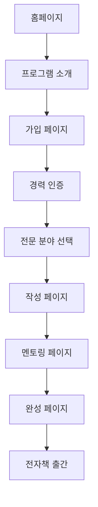

## 1. 제품 개요
10년 이상 경력의 직장인들이 자신의 전문성과 지식을 전자책으로 완성할 수 있도록 지원하는 프로그램입니다. 전자책 제작을 통해 개인의 전문성을 확장하고 새로운 가능성을 발견할 수 있도록 돕습니다.

## 2. 핵심 기능

### 2.1 사용자 역할
| 역할 | 가입 방식 | 핵심 권한 |
|------|-----------|-----------|
| 일반 회원 | 이메일 가입 | 프로그램 소개 확인, 가이드 다운로드 |
| 전문가 회원 | 경력 인증 후 가입 | 전자책 제작 툴 이용, 멘토링 받기, 커뮤니티 참여 |
| 멘토 | 초대 및 심사 | 멘토링 제공, 콘텐츠 검토 |

### 2.2 기능 모듈
프로그램은 다음 주요 페이지로 구성됩니다:
1. **소개 페이지**: 프로그램 정체성, 방법론, 성공 사례, 신뢰 신호
2. **가입 페이지**: 경력 인증, 전문 분야 선택
3. **작성 페이지**: 전자책 구조 잡기, 콘텐츠 작성, 템플릿 선택
4. **멘토링 페이지**: 전문가 피드백, 1:1 코칭 예약
5. **완성 페이지**: 전자책 출간, 배포 옵션, 성과 분석

### 2.3 페이지 상세
| 페이지명 | 모듈명 | 기능 설명 |
|----------|---------|-----------|
| 소개 페이지 | 정체성 섹션 | 10년 경력 직장인의 전문성을 전자책으로 연결한다는 비전 제시 |
| 소개 페이지 | 방법론 섹션 | 단계별 전자책 완성 프로세스, 필요한 도구와 지원 설명 |
| 소개 페이지 | 성공 사례 | 실제 참가자들의 전자책 완성 및 영역 확장 사례 소개 |
| 소개 페이지 | 신뢰 신호 | 파트너 기업, 전문가 네트워크, 프로그램 운영 성과 표시 |
| 가입 페이지 | 경력 인증 | 재직 증명서, 경력 기술서 제출 및 검증 |
| 가입 페이지 | 전문 분야 선택 | 현재 직무, 전문 분야, 작성 희망 주제 선택 |
| 작성 페이지 | 구조 잡기 | 책 제목, 목차, 챕터 구성 도구 제공 |
| 작성 페이지 | 콘텐츠 작성 | 에디터, 이미지 삽입, 표 생성 기능 |
| 작성 페이지 | 템플릿 선택 | 업종별, 주제별 전자책 템플릿 제공 |
| 멘토링 페이지 | 전문가 피드백 | 작성 중인 콘텐츠에 대한 전문가의 피드백 받기 |
| 멘토링 페이지 | 1:1 코칭 예약 | 온라인/오프라인 멘토링 세션 예약 |
| 완성 페이지 | 전자책 출간 | PDF, EPUB 등 다양한 형식으로 변환 |
| 완성 페이지 | 배포 옵션 | 개인 블로그, 전자책 플랫폼, SNS 공유 설정 |
| 완성 페이지 | 성과 분석 | 다운로드 수, 조회수, 독자 피드백 통계 제공 |

## 3. 핵심 프로세스
### 일반 사용자 플로우
홈페이지 방문 → 프로그램 소개 확인 → 가입 고려 → 가입 페이지 이동 → 경력 인증 → 전문 분야 선택 → 작성 페이지 접속 → 전자책 구성 → 콘텐츠 작성 → 멘토링 신청 → 피드백 반영 → 전자책 완성 → 출간 및 배포

### 멘토 플로우
멘토 가입 → 프로필 작성 → 멘토링 요청 확인 → 피드백 제공 → 1:1 코칭 진행 → 성과 확인

## 4. 사용자 인터페이스 디자인
### 4.1 디자인 스타일
- **주요 색상**: 짙은 남색(#1e3a8a) - 전문성과 신뢰감 표현
- **보조 색상**: 따뜻한 회색(#f8fafc) - 편안한 작업 환경
- **버튼 스타일**: 둥근 모서리, 그림자 효과로 입체감 부여
- **폰트**: Noto Sans KR, 본문 16px, 제목 24-32px
- **레이아웃**: 카드 기반, 상단 네비게이션
- **아이콘 스타일**: 단순한 선 아이콘, 일관된 두께 사용

### 4.2 페이지 디자인 개요
| 페이지명 | 모듈명 | UI 요소 |
|----------|---------|----------|
| 소개 페이지 | 정체성 섹션 | 전문가들의 모습을 보여주는 히어로 이미지, 강력한 헤드라인 "10년 경력, 새로운 도약의 시작" |
| 소개 페이지 | 방법론 섹션 | 단계별 프로세스를 시각적으로 표현한 다이어그램, 각 단계별 아이콘과 설명 |
| 소개 페이지 | 성공 사례 | 실제 참가자 프로필 사진, 전자책 커버 이미지, 성과 수치 카드 형식 배치 |
| 작성 페이지 | 구조 잡기 | 드래그 앤 드롭 가능한 목차 트리 구조, 실시간 미리보기 패널 |
| 멘토링 페이지 | 전문가 목록 | 멘토 프로필 카드, 전문 분야 태그, 가능한 시간대 표시 |

### 4.3 반응형 디자인
데스크톱 우선 접근법을 사용하며, 태블릿과 모바일에서도 최적화된 경험 제공. 터치 상호작용을 고려한 버튼 크기와 간격 설계.