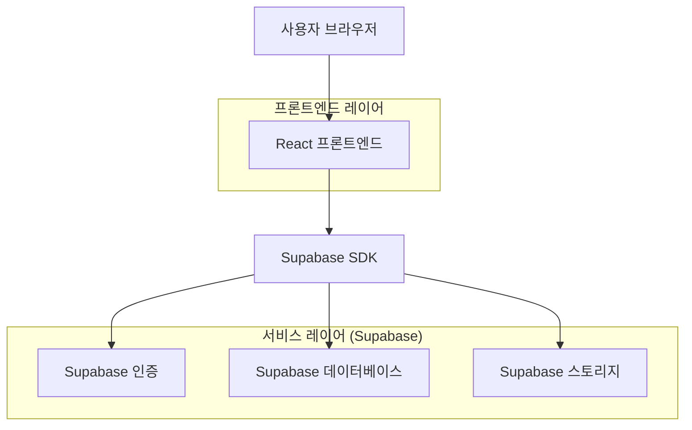
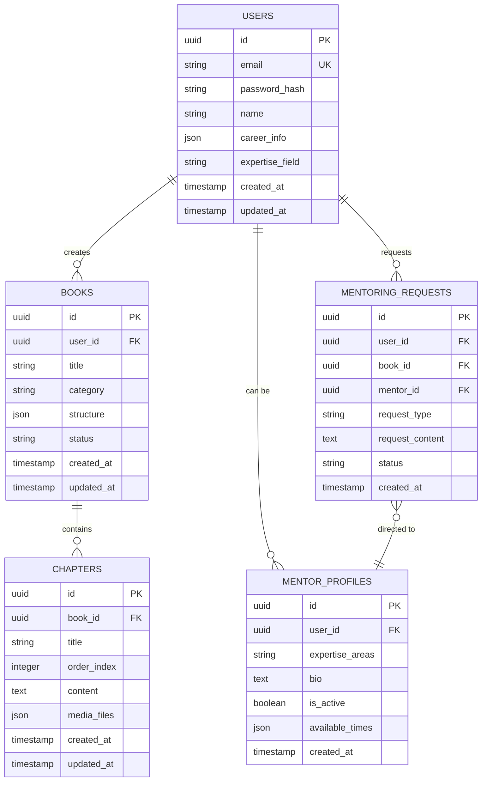

## 1. 아키텍처 설계



## 2. 기술 설명

* **프론트엔드**: React\@18 + tailwindcss\@3 + vite

* **초기화 도구**: vite-init

* **백엔드**: Supabase (인증, 데이터베이스, 파일 스토리지)

* **핵심 의존성**:

  * @supabase/supabase-js\@2

  * react-router-dom\@6

  * @tinymce/tinymce-react (에디터)

  * html2pdf.js (PDF 변환)

## 3. 라우트 정의

| 라우트          | 목적                 |
| ------------ | ------------------ |
| /            | 홈페이지, 프로그램 소개      |
| /signup      | 가입 페이지, 경력 인증      |
| /login       | 로그인 페이지            |
| /dashboard   | 대시보드, 작성 중인 전자책 목록 |
| /write/:id   | 전자책 작성 페이지         |
| /mentoring   | 멘토링 신청 및 관리        |
| /publish/:id | 전자책 출간 및 배포 설정     |
| /profile     | 사용자 프로필 관리         |

## 4. API 정의

### 4.1 핵심 API

**사용자 인증**

```
POST /auth/v1/signup
```

요청:

| 파라미터     | 타입     | 필수   | 설명           |
| -------- | ------ | ---- | ------------ |
| email    | string | true | 사용자 이메일      |
| password | string | true | 비밀번호         |
| metadata | object | true | 경력 정보, 전문 분야 |

**전자책 생성**

```
POST /rest/v1/books
```

요청:

| 파라미터      | 타입     | 필수   | 설명     |
| --------- | ------ | ---- | ------ |
| title     | string | true | 전자책 제목 |
| category  | string | true | 카테고리   |
| structure | json   | true | 목차 구조  |

**멘토링 요청**

```
POST /rest/v1/mentoring_requests
```

요청:

| 파라미터          | 타입     | 필수   | 설명                         |
| ------------- | ------ | ---- | -------------------------- |
| book\_id      | uuid   | true | 전자책 ID                     |
| mentor\_id    | uuid   | true | 멘토 ID                      |
| request\_type | string | true | 요청 유형 (feedback, coaching) |

## 5. 데이터 모델

### 5.1 데이터 모델 정의



### 5.2 데이터 정의어

**사용자 테이블 (users)**

```sql
-- 테이블 생성
CREATE TABLE users (
    id UUID PRIMARY KEY DEFAULT gen_random_uuid(),
    email VARCHAR(255) UNIQUE NOT NULL,
    password_hash VARCHAR(255) NOT NULL,
    name VARCHAR(100) NOT NULL,
    career_info JSONB DEFAULT '{}',
    expertise_field VARCHAR(100),
    created_at TIMESTAMP WITH TIME ZONE DEFAULT NOW(),
    updated_at TIMESTAMP WITH TIME ZONE DEFAULT NOW()
);

-- 인덱스 생성
CREATE INDEX idx_users_email ON users(email);
CREATE INDEX idx_users_expertise ON users(expertise_field);

-- 권한 설정
GRANT SELECT ON users TO anon;
GRANT ALL PRIVILEGES ON users TO authenticated;
```

**전자책 테이블 (books)**

```sql
-- 테이블 생성
CREATE TABLE books (
    id UUID PRIMARY KEY DEFAULT gen_random_uuid(),
    user_id UUID REFERENCES users(id) ON DELETE CASCADE,
    title VARCHAR(255) NOT NULL,
    category VARCHAR(100) NOT NULL,
    structure JSONB DEFAULT '{}',
    status VARCHAR(50) DEFAULT 'draft' CHECK (status IN ('draft', 'review', 'published')),
    created_at TIMESTAMP WITH TIME ZONE DEFAULT NOW(),
    updated_at TIMESTAMP WITH TIME ZONE DEFAULT NOW()
);

-- 인덱스 생성
CREATE INDEX idx_books_user_id ON books(user_id);
CREATE INDEX idx_books_status ON books(status);
CREATE INDEX idx_books_category ON books(category);

-- 권한 설정
GRANT SELECT ON books TO anon;
GRANT ALL PRIVILEGES ON books TO authenticated;
```

**챕터 테이블 (chapters)**

```sql
-- 테이블 생성
CREATE TABLE chapters (
    id UUID PRIMARY KEY DEFAULT gen_random_uuid(),
    book_id UUID REFERENCES books(id) ON DELETE CASCADE,
    title VARCHAR(255) NOT NULL,
    order_index INTEGER NOT NULL,
    content TEXT,
    media_files JSONB DEFAULT '{}',
    created_at TIMESTAMP WITH TIME ZONE DEFAULT NOW(),
    updated_at TIMESTAMP WITH TIME ZONE DEFAULT NOW()
);

-- 인덱스 생성
CREATE INDEX idx_chapters_book_id ON chapters(book_id);
CREATE INDEX idx_chapters_order ON chapters(order_index);

-- 권한 설정
GRANT SELECT ON chapters TO anon;
GRANT ALL PRIVILEGES ON chapters TO authenticated;
```

**멘토 프로필 테이블 (mentor\_profiles)**

```sql
-- 테이블 생성
CREATE TABLE mentor_profiles (
    id UUID PRIMARY KEY DEFAULT gen_random_uuid(),
    user_id UUID REFERENCES users(id) ON DELETE CASCADE,
    expertise_areas TEXT NOT NULL,
    bio TEXT,
    is_active BOOLEAN DEFAULT true,
    available_times JSONB DEFAULT '{}',
    created_at TIMESTAMP WITH TIME ZONE DEFAULT NOW()
);

-- 인덱스 생성
CREATE INDEX idx_mentor_profiles_user_id ON mentor_profiles(user_id);
CREATE INDEX idx_mentor_profiles_active ON mentor_profiles(is_active);

-- 권한 설정
GRANT SELECT ON mentor_profiles TO anon;
GRANT ALL PRIVILEGES ON mentor_profiles TO authenticated;
```

**멘토링 요청 테이블 (mentoring\_requests)**

```sql
-- 테이블 생성
CREATE TABLE mentoring_requests (
    id UUID PRIMARY KEY DEFAULT gen_random_uuid(),
    user_id UUID REFERENCES users(id) ON DELETE CASCADE,
    book_id UUID REFERENCES books(id) ON DELETE CASCADE,
    mentor_id UUID REFERENCES users(id) ON DELETE CASCADE,
    request_type VARCHAR(50) NOT NULL CHECK (request_type IN ('feedback', 'coaching')),
    request_content TEXT,
    status VARCHAR(50) DEFAULT 'pending' CHECK (status IN ('pending', 'accepted', 'rejected', 'completed')),
    created_at TIMESTAMP WITH TIME ZONE DEFAULT NOW()
);

-- 인덱스 생성
CREATE INDEX idx_mentoring_requests_user_id ON mentoring_requests(user_id);
CREATE INDEX idx_mentoring_requests_mentor_id ON mentoring_requests(mentor_id);
CREATE INDEX idx_mentoring_requests_status ON mentoring_requests(status);

-- 권한 설정
GRANT SELECT ON mentoring_requests TO anon;
GRANT ALL PRIVILEGES ON mentoring_requests TO authenticated;
```

