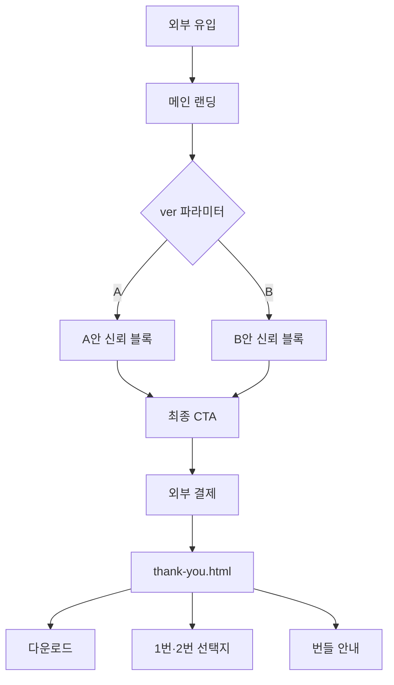

## 1. Product Overview
한나전 0번 전자책 기획안 시스템을 판매하는 고전환율 MVP 랜딩페이지. 관심 단계 방문자가 "나도 해보고 싶다"라고 느끼게 하고, 39,000원을 결제하도록 유도하며, 결제 후 1번·2번 상품으로 자연스럽게 이어지는 구조.

## 2. Core Features

### 2.1 User Roles
해당 없음 – 자동화 MVP로 회원가입·로그인 기능 없음

### 2.2 Feature Module
총 3개의 필수 페이지로 구성:
1. **메인 랜딩 페이지**: 프리-히어로·히어로·문제 공감·해결 방식·0번 상품 소개·신뢰 블록(A/B)·최종 CTA
2. **결제 완료 페이지**: 구매 감사·다운로드·1번·2번 상품 선택지
3. **번들 안내 페이지**: 한 번에 끝내기 위한 번들 제시

### 2.3 Page Details
| Page Name | Module Name | Feature description |
|-----------|-------------|---------------------|
| 메인 랜딩 | 프리-히어로 | 짧은 스토리로 시작, 전자책 가치(남는다·대신 말해준다·반복 설명 없음) 제시 |
| 메인 랜딩 | 히어로 | 메인 헤드라인·서브 문구·결제 CTA 버튼 표시 |
| 메인 랜딩 | 문제 공감 | 전자책이 멈추는 이유 나열, ‘기준 부재’가 원인임 강조 |
| 메인 랜딩 | 해결 방식 | “한나전은 항상 0번 기획안부터” 설명, 기획안을 나침반으로 비유 |
| 메인 랜딩 | 0번 상품 소개 | 기획안 템플릿 1장·AI 사고 검증 12문항 포함, 방향 고정·되돌아감 감소 효과 제시 |
| 메인 랜딩 | 한나전 검증 | 5년간 2,000명 수강·300권 완성 데이터로 신뢰도 제고 |
| 메인 랜딩 | A/B 신뢰 블록 | URL 파라미터 ver=A/B 에 따라 A안(구조 중심)·B안(사람+구조) 문구 노출 |
| 메인 랜딩 | 최종 CTA | “지금, 전자책의 방향부터 잡기” 버튼, PAYMENT_LINK 로 연결 |
| 결제 완료 | 구매 감사 | “구매 완료, 방향은 흔들리지 않습니다” 메시지 표시 |
| 결제 완료 | 다운로드 | 기획안 템플릿·AI 검증 질문 2개 파일 다운로드 버튼 제공 |
| 결제 완료 | 다음 선택지 | “제목·목차가 가장 많이 막힌다” 안내 후 1번·2번 상품 미니 소개 및 버튼 |
| 번들 안내 | 번들 제시 | “전자책을 한 번에 끝내고 싶다면” 헤드라인, 0-1-2번 구성·할인 가격·번들 CTA 버튼 |

## 3. Core Process
방문자 흐름(자동화 MVP):
1. 외부 유입 → 메인 랜딩 페이지 도착
2. 프리-히어로·히어로 섹션으로 흥미 유발
3. 문제 공감·해결 방식·0번 상품 정보 확인
4. A/B 신뢰 블록 노출(ver 파라미터 기준)
5. 최종 CTA 클릭 → 결제 링크 → 외부 결제 시스템
6. 결제 완료 후 thank-you.html 로 리다이렉트
7. 다운로드 및 1번·2번·번들 선택지 확인
8. 추가 구매 또는 종료

## 4. User Interface Design

### 4.1 Design Style
- Primary color: #0f766e (진한 청록·신뢰)
- Secondary color: #f8fafc (밝은 회톤 배경)
- 버튼: 둥근 모서리 8px, 그림자 없이 플랫, 호버 시 5% 어둡게
- 폰트: Pretendard 또는 sans-serif, 기본 16px, 헤더 28-32px
- 레이아웃: 단일 컬럼, 카드 없이 섹션 구분, 여백 충분
- 아이콘: 단순 라인 아이콘으로 최소화

### 4.2 Page Design Overview
| Page Name | Module Name | UI Elements |
|-------------|-------------|-------------|
| 메인 랜딩 | 프리-히어로 | 중앙 정렬 텍스트, 640px 최대 너비, 연한 회색 배경 |
| 메인 랜딩 | 히어로 | 진한 청록 배경, 흰색 글씨, 중앙 CTA 버튼 |
| 메인 랜딩 | 문제 공감 | 왼쪽 정렬 리스트, 아이콘 없이 텍스트만 |
| 메인 랜딩 | 해결 방식 | 밝은 배경, 좌우 여백 5%, 중앙 정렬 |
| 메인 랜딩 | 0번 상품 | 흰색 카드처럼 섹션, 두꺼운 테두리 없음, 체크 아이콘 2개 |
| 메인 랜딩 | A/B 블록 | 동일 레이아웃, 문구만 교체 가능하도록 span 태그 |
| 결제 완료 | 전체 | 중앙 정렬, 480px 최대 너비, 두 개 다운로드 버튼 수직 배치 |
| 번들 안내 | 전체 | 단일 섹션, 가격 강조(빨간색), 버튼은 진한 청록 |

### 4.3 Responsiveness
모바일 우선 반응형: 320px 부터 시작, 768px 에서 여백 확대, 1024px 에서 최대 960px 고정. 터치 최적화 버튼 높이 48px 이상.

### 4.4 3D Scene Guidance
해당 없음