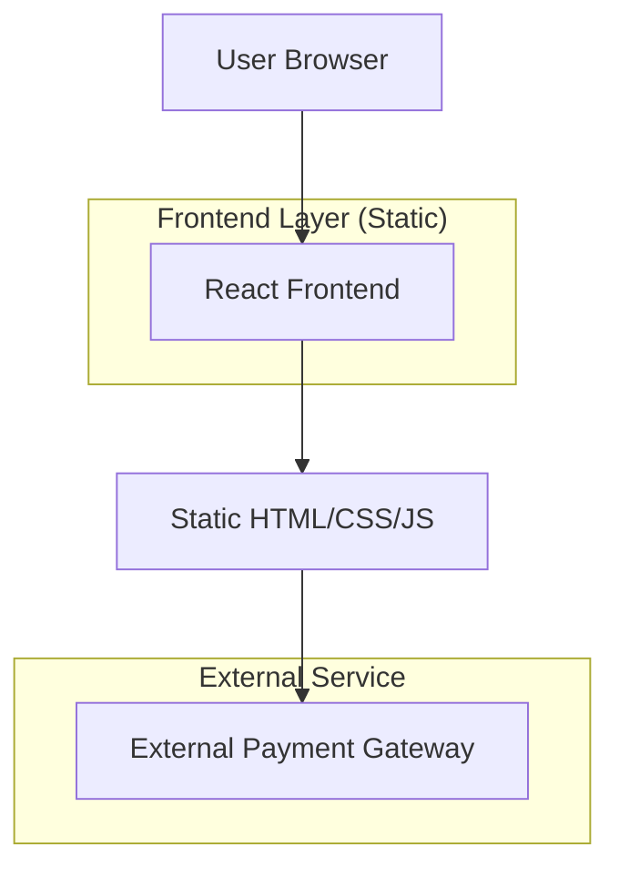

## 1. Architecture design

## 2. Technology Description
- Frontend: React@18 + tailwindcss@3 + vite
- Initialization Tool: vite-init
- Backend: None – 정적 사이트로 배포
- 호스팅: Netlify 또는 Vercel (자동 배포)

## 3. Route definitions
| Route | Purpose |
|-------|---------|
| / | 메인 랜딩 페이지 (index.html) |
| /thank-you.html | 결제 완료 후 다운로드 및 업셀 안내 |
| /bundle.html | 0-1-2번 번들 안내 페이지 |

## 4. API definitions
해당 없음 – 외부 결제 링크(PAYMENT_LINK)로 리다이렉트만 수행

## 5. Server architecture diagram
해당 없음 – 정적 사이트로 서버 없음

## 6. Data model
해당 없음 – 데이터베이스 없음, 모든 콘텐츠는 정적 HTML로 포함