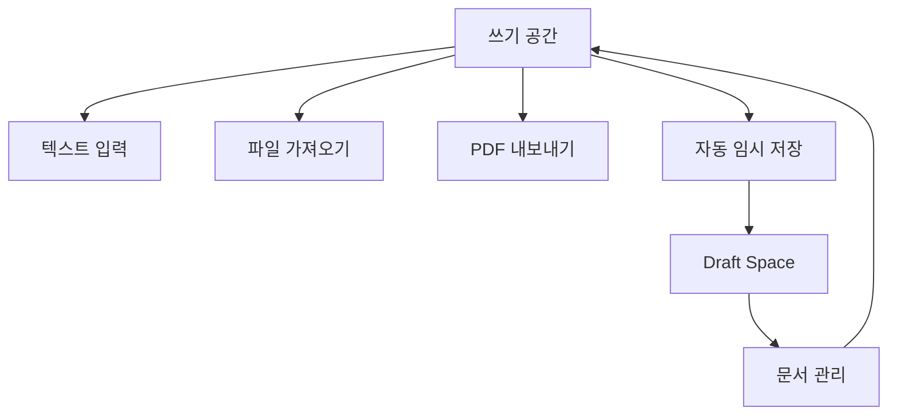

## 1. Product Overview
간단한 문서 작성 및 PDF 변환 서비스. 사용자가 텍스트를 작성하고 PDF로 내보낼 수 있는 기능을 제공합니다.

## 2. Core Features

### 2.1 User Roles
사용자 인증이 필요 없는 단순한 서비스로, 모든 사용자가 동일한 기능에 접근할 수 있습니다.

### 2.2 Feature Module
본 서비스는 다음의 주요 페이지로 구성됩니다:
1. **쓰기 공간**: 텍스트 편집기, 파일 가져오기, PDF 내보내기
2. **Draft Space**: 임시 저장된 문서 목록, 문서 관리

### 2.3 Page Details
| Page Name | Module Name | Feature description |
|-----------|-------------|---------------------|
| 쓰기 공간 | 텍스트 편집기 | 실시간으로 텍스트 입력 및 편집 가능 |
| 쓰기 공간 | 파일 가져오기 | 드래그앤드롭 또는 클릭으로 파일 업로드 |
| 쓰기 공간 | PDF 내보내기 | 현재 작성 중인 내용을 PDF 파일로 다운로드 |
| Draft Space | 문서 목록 | 임시 저장된 모든 문서를 리스트로 표시 |
| Draft Space | 문서 관리 | 문서 열기, 삭제, 이름 변경 기능 제공 |

## 3. Core Process
사용자는 쓰기 공간에서 텍스트를 입력하고 필요시 파일을 가져와서 내용을 추가할 수 있습니다. 작성 중인 내용은 자동으로 임시 저장되며 언제든지 PDF로 내보낼 수 있습니다. 임시 저장된 문서는 Draft Space에서 관리할 수 있습니다.

## 4. User Interface Design

### 4.1 Design Style
- 주요 색상: 흰색 배경에 진한 회색 텍스트
- 보조 색상: 파란색 강조색상
- 버튼 스타일: 둥근 모서리의 플랫 디자인
- 폰트: Sans-serif 계열, 기본 크기 16px
- 레이아웃: 상단 네비게이션 바, 중앙 콘텐츠 영역

### 4.2 Page Design Overview
| Page Name | Module Name | UI Elements |
|-----------|-------------|-------------|
| 쓰기 공간 | 텍스트 편집기 | 전체 화면 너비를 사용하는 텍스트 영역, 상단 툴바에 PDF 버튼 |
| 쓰기 공간 | 파일 가져오기 | 드래그앤드롭 영역 또는 파일 선택 버튼 |
| Draft Space | 문서 목록 | 카드 형식의 문서 리스트, 각 카드에 제목과 수정일 |

### 4.3 Responsiveness
데스크톱 우선 설계로 모바일에서도 사용 가능하도록 반응형 디자인 적용