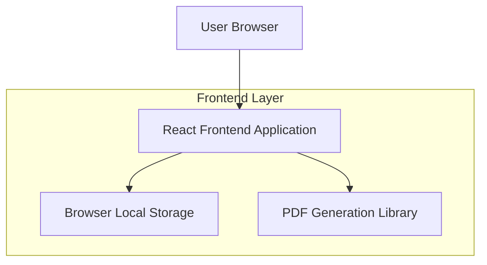
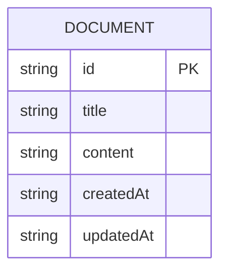

## 1. Architecture design

## 2. Technology Description
- Frontend: React@18 + tailwindcss@3 + vite
- Initialization Tool: vite-init
- Backend: None (브라우저에서 모든 기능 처리)

## 3. Route definitions
| Route | Purpose |
|-------|---------|
| / | 쓰기 공간 메인 페이지 |
| /drafts | Draft Space 문서 관리 페이지 |

## 4. API definitions
해당 프로젝트는 백엔드 서버 없이 브라우저에서 모든 기능을 처리하므로 API가 없습니다.

## 5. Server architecture diagram
해당 프로젝트는 서버 없이 클라이언트 측에서만 작동합니다.

## 6. Data model
### 6.1 Data model definition

### 6.2 Data Definition Language
브라우저의 LocalStorage를 사용하므로 별도의 데이터베이스 DDL이 필요 없습니다. 문서는 JSON 형식으로 저장됩니다.